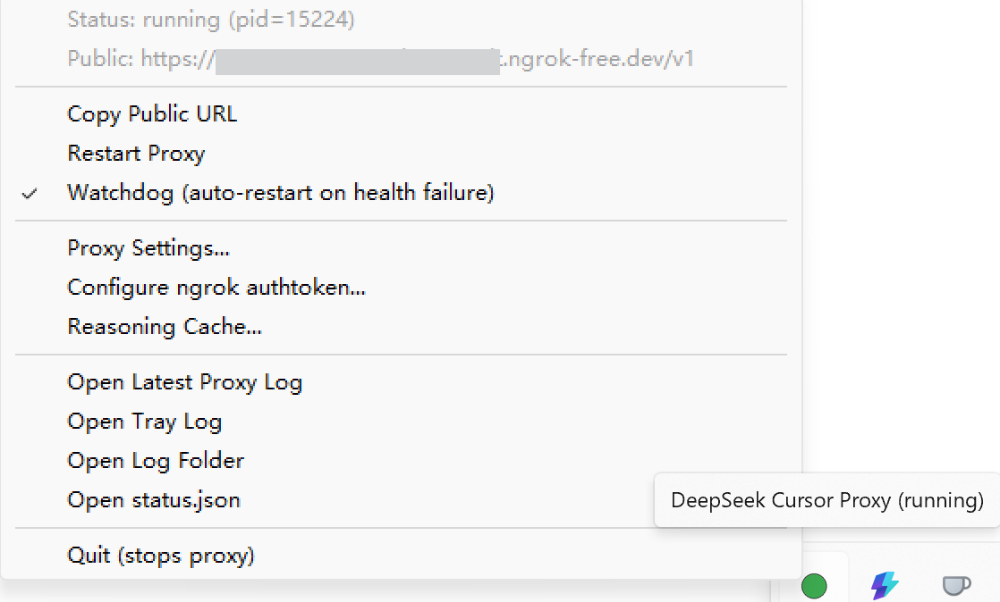
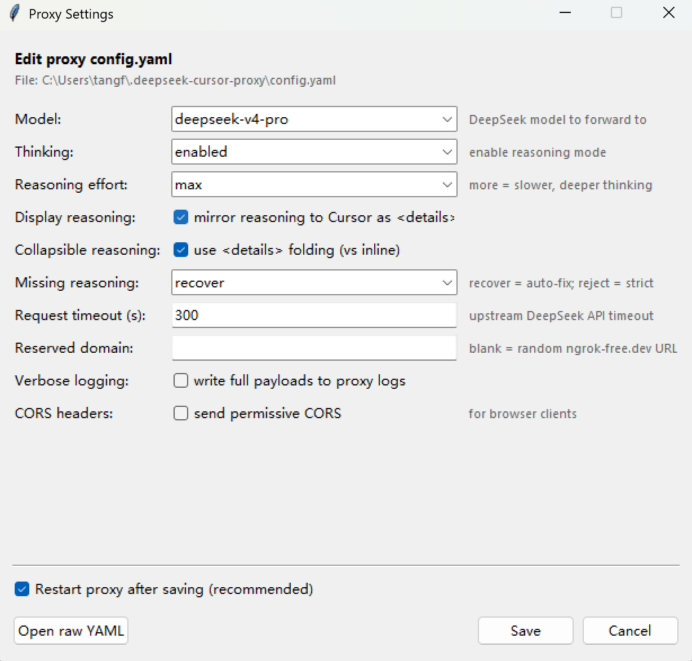
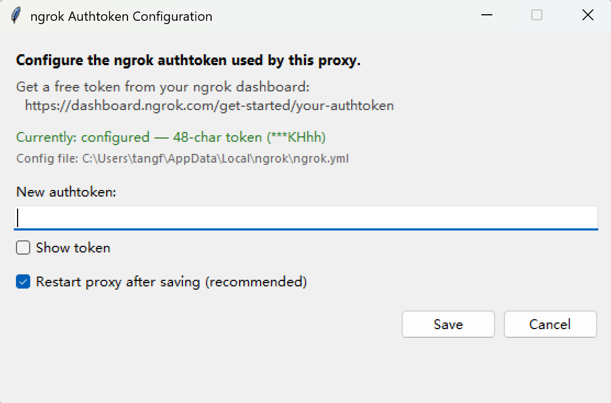
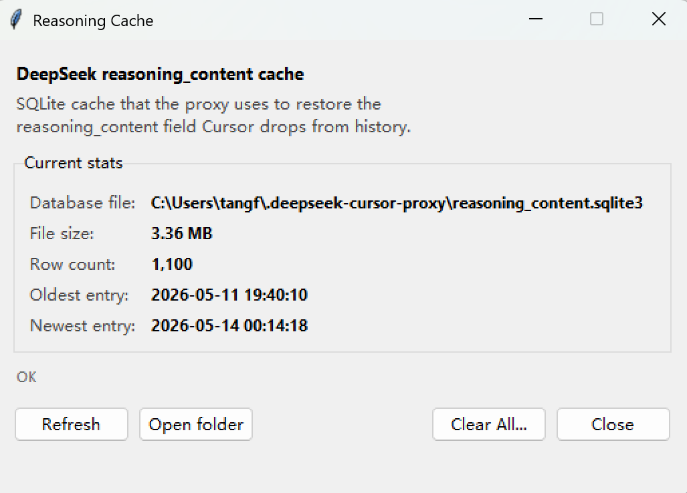

# deepseek-cursor-proxy-tray

Windows system-tray supervisor for [`yxlao/deepseek-cursor-proxy`](https://github.com/yxlao/deepseek-cursor-proxy).

Adds **zero-console-flicker autostart**, a **state-machine watchdog with labeled error states**, and **GUI windows** for editing `config.yaml`, configuring the ngrok authtoken, and managing the reasoning cache — so you stop hand-editing YAML and running `--clear-reasoning-cache` from the terminal.



## Why this exists

The [upstream proxy](https://github.com/yxlao/deepseek-cursor-proxy) is a great CLI, but running it as a long-lived service on Windows has friction:

- `powershell.exe ... -WindowStyle Hidden` from Task Scheduler **still flashes a console window** at every run/restart.
- `Stop-Process -Force` to restart the proxy hard-kills ngrok before its tunnel session can be released, occasionally causing `provider error` on the next start.
- When the proxy hangs or crashes, you find out from Cursor failing, not from the OS.
- `ngrok authtoken`, `config.yaml`, and the `--clear-reasoning-cache` CLI flag all require hand-editing or terminal incantations.

This repo solves all of the above. The tray app:

- Launches via `pythonw.exe -m dscp_tray` (no console allocation — **truly silent autostart**)
- Owns the proxy subprocess and `taskkill /T /F` the whole tree (proxy + ngrok) on stop, so ngrok cloud sessions release cleanly
- Probes `/healthz` every 60 s, requires 3 consecutive failures before restarting, and waits 8 s between stop and start to avoid session collisions
- Distinguishes 5 lifecycle states by icon color and surfaces 7 distinct error labels
- Exposes config, authtoken, and cache management as native tkinter dialogs (see screenshots below)

## Quick install

Grab `dscp-tray-setup-<version>.exe` from the [latest release](https://github.com/xhml-tangf/deepseek-cursor-proxy-tray/releases/latest) and double-click it.

- Per-user install, **no admin required**
- Bundles a self-contained Python 3.12 (with tkinter); **you don't need Python on your machine**
- Bundles both wheels (this project + the upstream proxy), so install is fully offline once downloaded
- Optionally `winget install`s ngrok for you if missing
- Registers Task Scheduler logon autostart via standard `Register-ScheduledTask`
- Clean uninstall via Add/Remove Programs

On first launch, if you haven't configured the ngrok authtoken yet, the tray will land in `STATE_ERROR` with label `authtoken-missing` and **auto-open the config window** so you can paste your token.

Once running, right-click the tray icon → **Copy Public URL**, paste into Cursor's custom model settings as the Base URL.

## The tray, screen by screen

### Main menu


Right-click the tray icon to get the full menu. From top to bottom:

- **Status: …** — shows the current state (`stopped` / `starting` / `running` / `stopping` / `error`) and the proxy PID; in `running` with accumulated health failures it also shows `health failures N/3`. Non-interactive.
- **Public: …** — the current ngrok public URL, or `(waiting for ngrok...)` during startup. Non-interactive.
- **Copy Public URL** — drops the public URL into your clipboard, ready to paste into Cursor.
- **Restart Proxy** — composite verb: `stop_proxy()` → 8 s grace → `start_proxy()`. Clears any stale health-failure counter so the watchdog can't get stuck in a feedback loop.
- **Watchdog (auto-restart on health failure)** — checkbox; toggle to disable the in-process health probe when you want to leave the proxy alone (e.g. while investigating upstream issues).
- **Proxy Settings… / Configure ngrok authtoken… / Reasoning Cache…** — open the three configuration windows shown below.
- **Open …** — convenience handles for the latest proxy log, the tray log, the log folder, and `status.json`.
- **Quit (stops proxy)** — graceful shutdown of the proxy then the tray.

The bottom-right of the screenshot also shows the tray icon itself — green = `running`. Other states use different colors (amber for `starting`, blue-gray for `stopping`, gray for `stopped`, red for `error`, orange tint when `running` is accumulating health failures).

### Proxy Settings…



Structured editor over `~/.deepseek-cursor-proxy/config.yaml`. Exposes the 10 most-tuned keys:

| Field | Type | Notes |
|---|---|---|
| Model | dropdown | `deepseek-v4-pro` / `deepseek-v4-flash` |
| Thinking | dropdown | `enabled` / `disabled` |
| Reasoning effort | dropdown | `low` / `medium` / `high` / `max` / `xhigh` |
| Display reasoning | checkbox | mirror reasoning into the Cursor-visible `<details>` block |
| Collapsible reasoning | checkbox | use `<details>` folding vs inline |
| Missing reasoning | dropdown | `recover` (auto-fix) / `reject` (strict) |
| Request timeout (s) | text | upstream DeepSeek API timeout |
| Reserved domain | text | the optional fixed ngrok subdomain |
| Verbose logging | checkbox | dump full payloads to the proxy log |
| CORS headers | checkbox | for browser clients |

Save reloads the YAML, merges the form values in, and writes back — **preserving any keys not exposed in the UI** (host, port, cache limits, etc.). The "Restart proxy after saving" checkbox is on by default so new settings take effect immediately. "Open raw YAML" drops to the system editor for advanced fields.

The `ngrok` on/off switch is intentionally not exposed — disabling it makes the proxy useless to Cursor. If you really need local-only mode, hand-edit the YAML.

### Configure ngrok authtoken…



Reads `%LOCALAPPDATA%\ngrok\ngrok.yml` to show whether a token is configured. The current value is **never displayed in cleartext** — the status line shows only the token length and the last 4 characters (`Currently: configured — 48-char token (***KHhh)` in the screenshot).

The input field is masked by default; tick "Show token" to verify what you typed. Save runs `ngrok config add-authtoken <token>` via subprocess. "Restart proxy after saving" is on by default so the new token is picked up immediately.

This window also pops up automatically the first time the proxy starts without a configured token (preflight error `authtoken-missing`), so new installs walk straight through it without a terminal step.

### Reasoning Cache…



Reads `~/.deepseek-cursor-proxy/reasoning_content.sqlite3` in **SQLite read-only URI mode** (no locking even while the proxy is hammering it). Shows the database path, file size, row count, and the timestamps of the oldest and newest cached entries.

- **Refresh** — re-query.
- **Open folder** — open the data directory.
- **Clear All…** — calls the upstream `ReasoningStore.clear()` directly (no CLI subprocess, no proxy restart required) after a confirmation dialog. The dialog spells out the consequences: in-flight conversations may lose the cached thinking trace for past tool calls, and DeepSeek will likely re-think from scratch on the next turn. `missing_reasoning_strategy=recover` in the proxy keeps everything working, just slower.
- **Close** — close the window.

## State machine

```
      ┌─────────┐  start_proxy()   ┌──────────┐  health OK    ┌─────────┐
      │ stopped │ ───────────────► │ starting │ ────────────► │ running │
      └─────────┘                  └──────────┘               └─────────┘
           ▲                            │                          │
           │                            │ fail                     │ crash /
           │                            ▼                          │ probe-fail x3
           │                       ┌─────────┐                     │
           │                       │  error  │ ◄───────────────────┘
           │                       └─────────┘
           │       stop_proxy()         │
           │      ┌──────────┐          │ restart (user / watchdog)
           └──────┤ stopping │ ◄────────┘
                  └──────────┘
```

| State | Icon | Meaning |
|---|---|---|
| `stopped`  | gray      | Clean idle (initial, after user Quit, after Dismiss Error) |
| `starting` | amber     | Launching proxy + waiting for ngrok public URL |
| `running`  | green     | `/healthz` OK. Accumulated health failures tint it **orange** as a sub-flag |
| `stopping` | blue-gray | Tearing down via `taskkill /T /F` |
| `error`    | red       | Last attempt failed or proxy crashed; carries a labeled cause |

"Restart" is not a state — it's `stop_proxy()` then `start_proxy()`. "Unhealthy" is not a state either — it's a sub-flag of `running` (icon turns orange while the failure counter is non-zero).

## Error labels

| Label | When |
|---|---|
| `exe-missing`        | `deepseek-cursor-proxy.exe` not found in venv or on PATH (and the bundled module isn't importable either) |
| `launch-failed`      | `subprocess.Popen` raised `OSError` |
| `startup-exit`       | Proxy exited before reporting a public URL (ngrok auth failure, port conflict, …) |
| `crashed`            | Proxy process disappeared during `running` (3 consecutive missed heartbeats) |
| `unresponsive`       | Proxy alive but `/healthz` timed out 3 times in a row |
| `ngrok-missing`      | Preflight: `ngrok.exe` not findable; install via `winget install Ngrok.Ngrok` |
| `authtoken-missing`  | Preflight: `ngrok.yml` has no authtoken; the config window auto-opens |

`status.json` exports `state`, `lastError`, and `lastErrorLabel` for external monitoring.

## Health check parameters

| Parameter | Default | Why |
|---|---|---|
| Probe interval | 60 s | Avoid false positives during long SSE streams |
| Per-probe timeout | 10 s | Slack for occasional GC pauses / SQLite checkpoints |
| Failure threshold | 3 | One bad blip ignored; three = real problem |
| Stop grace before next start | 8 s | Let ngrok's cloud-side session release |
| ngrok URL wait | 35 s | Cold-start tolerance for the tunnel |
| `tray.log` rotation | 1 MB × 3 | Hard cap ≈ 4 MB |

## Data layout

| Path | Owner | Content |
|---|---|---|
| `~/.deepseek-cursor-proxy/config.yaml`               | upstream | model / thinking / ngrok / cache settings |
| `~/.deepseek-cursor-proxy/reasoning_content.sqlite3` | upstream | `reasoning_content` cache |
| `~/.deepseek-cursor-proxy/status.json`               | tray     | `state`, `lastError`, `pid`, `publicUrl`, `startedAt`, … |
| `~/.deepseek-cursor-proxy/logs/proxy-{ts}.log`       | upstream | proxy stdout/stderr per launch |
| `~/.deepseek-cursor-proxy/logs/tray.log`             | tray     | rotating tray supervisor log |
| `%LOCALAPPDATA%\dscp-tray\`                          | installer| bundled CPython + wheels (when installed via Setup.exe) |
| `%LOCALAPPDATA%\ngrok\ngrok.yml`                     | ngrok    | authtoken + ngrok agent config |

## Architecture

```
[Task Scheduler @ Logon]
         │
         ▼
  pythonw.exe -m dscp_tray        ← single autostart entry, no console window
         │
         ├─ pystray icon + right-click menu
         ├─ supervisor thread: starts proxy, runs /healthz every 60s
         ├─ tkinter dialogs (authtoken, settings, cache) — daemon threads
         │
         └─► subprocess: deepseek_cursor_proxy   ← upstream proxy (as a module)
                ├─ stdout / stderr → logs/proxy-{ts}.log
                └─► subprocess: ngrok.exe → public URL
```

The tray and proxy share `~/.deepseek-cursor-proxy/` so the CLI and the tray see consistent state.

## Common operations

```powershell
# Inspect runtime state
Get-Content $env:USERPROFILE\.deepseek-cursor-proxy\status.json | ConvertFrom-Json

# Tail the tray log
Get-Content $env:USERPROFILE\.deepseek-cursor-proxy\logs\tray.log -Wait -Tail 30

# Probe locally
Invoke-WebRequest http://127.0.0.1:9000/healthz

# Trigger an autostart manually (e.g. right after install without re-logging in)
Start-ScheduledTask -TaskName 'DeepSeekCursorProxy'
```

To uninstall: open Settings → Apps → search "DeepSeek Cursor Proxy Tray" → Uninstall. The uninstaller stops the running tray, removes the scheduled task, and deletes the install directory. User data under `~/.deepseek-cursor-proxy/` is preserved.

## Troubleshooting

| Symptom | Fix |
|---|---|
| Tray icon never appears        | Read `~/.deepseek-cursor-proxy/logs/tray.log`. Most often the install dir got moved/corrupted. Reinstall. |
| Red icon, label `ngrok-missing`     | `winget install Ngrok.Ngrok`, then right-click → Restart Proxy. |
| Red icon, label `authtoken-missing` | The config window opens automatically; paste your token from <https://dashboard.ngrok.com/get-started/your-authtoken> and save. |
| Red icon, label `startup-exit` | Inspect `logs/proxy-{ts}.err.log`. Usually ngrok auth, domain conflict, or port 9000 still occupied. |
| Red icon, label `crashed`      | The proxy died unexpectedly. Look at the most recent `proxy-{ts}.log`; click Restart Proxy to retry. |
| Red icon, label `unresponsive` | Proxy alive but `/healthz` timing out. Upstream DeepSeek API is likely throttling or the proxy is blocked on a long SSE stream. Wait or click Restart. |
| Orange icon (running but warning) | Single missed health probe. Auto-recovers after the next success; no action needed. |
| Cursor reports `provider error` after a restart | Should not happen anymore (we wait 8 s between stop and start). If it does, file an issue with `tray.log`. |

## Building from source

```powershell
git clone https://github.com/xhml-tangf/deepseek-cursor-proxy-tray.git
cd deepseek-cursor-proxy-tray
uv sync                          # pulls the upstream proxy from GitHub
.\scripts\start-tray.ps1         # manual launch (no Task Scheduler entry)
```

To rebuild the installer (requires Inno Setup 6 — `winget install JRSoftware.InnoSetup` — and a Python 3.12.x install on the build machine):

```powershell
.\installer\build-installer.ps1
# Result: installer\out\dscp-tray-setup-0.1.0.exe (~20 MB)
```

## Credits

This is a downstream wrapper for [`yxlao/deepseek-cursor-proxy`](https://github.com/yxlao/deepseek-cursor-proxy). All of the actual proxy magic — reasoning_content scope hashing, multi-turn cache lookup, streaming SSE rewriter, ngrok integration — lives there.

## License

MIT. See [LICENSE](LICENSE). The upstream proxy is also MIT, by Yixing Lao.
